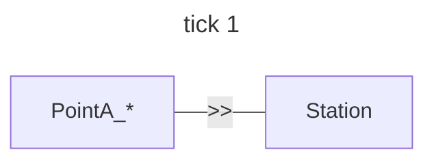
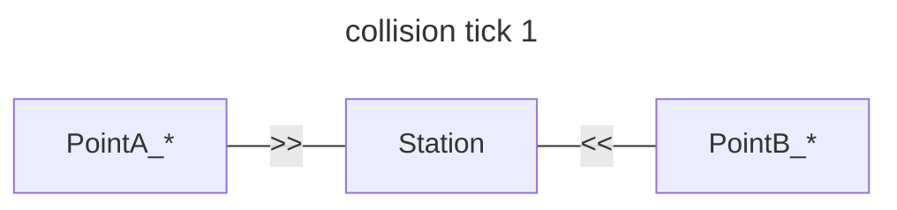

# Intro

This rfc represents the basic concepts that governs the api.

## Time handling

This project assumes complete inertia of train movements. The "prediction" of the route collision will be based on the premise that every train would travel a station per "tick". This is to make stateless and (hopefully) easier to build upon it. So for the example route below the movement between two ticks would happen like in the graph:

## Collision

The main feature of the project is to check if a given station configuration and train routes might lead to a collision.
For this project, a collision happens whenever two trains are predicted to be in the same station. For simplicity:

- trains can travel both directions, but have only one track.
- trains occupy their destination for one tick, then that station gets unnocupied

## Multiple routes

For simplicity, the trains will always try to go through the "quickest route". So in case of there being two routes of the same length available, the output might be unprecise.

---

#### Basic Movement 

```
{
    "station_graph": [
        { "start": "Point A", "end": "Station" }
    ],
    "route": {
        { "start": "Point A", "end": "Station" }
    }
}
```

The * mark the station as `occupied`:




```mermaid
---
title: tick 2
---
flowchart LR
    PointA -- -- --- Station_*
```

```mermaid
---
title: tick 3
---
flowchart LR
    PointA -- -- --- Station
```


#### Collision

A collision happens when two trains are in the same station at the same `tick`. A simple example below.
A `#` represents a collision

```
{
    "station_graph": [
        {"start": "Point 1", "end": "Station" },
        {"start": "Station", "end": "Point B" }
    ],
    "routes": [
        {"start": "Entry Signal West", "end": "Point B", "occupied": true }
    ],
    "check_route": {"start": "Entry Signal West", "end": "Exit Signal East 2" }
}
```




```mermaid
---
title: collision  tick 2
---
flowchart LR
    PointA -- -- --- Station_# -- -- --- PointB
```
